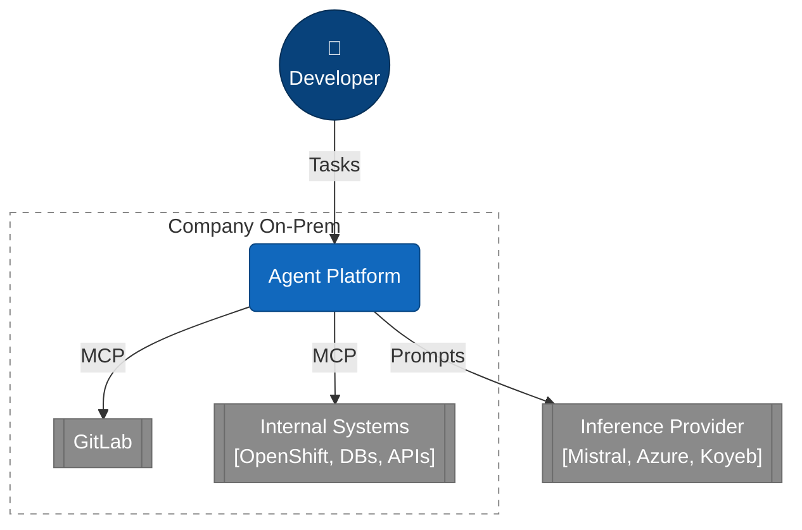

# Coding Agent

Architecture evaluation for an **agentic coding platform at a Company** with maximum data sovereignty: agents work on confidential code and internal systems, while LLM inference is consumed as an external service (no own GPUs, no own model hosting).

## Overview



The central question is **where the agent runtime lives** – this defines the trust boundary:

| | Variant A – Remote Inference | Variant B – Cloud Agent Runtime |
|---|---|---|
| Agent, memory, state | On-prem | Cloud |
| Tools | On-prem | On-prem, via MCP Gateway |
| LLM | External | External |
| Crosses the boundary | Minimized prompts only | Prompts, agent state, tool results |
| Security boundary | LLM Gateway (egress) | MCP Gateway (ingress) |
| Data sovereignty | Maximum | Reduced |

## Project Structure

```text
coding-agent/
├── README.md
├── agentic-workflows.md
├── remote-inference-agent-on-prem.md
├── cloud-agent-cloud-llm
└── sources/
    └── README.md
```

## Documents

| Document | Content |
|---|---|
| [Agentic Workflows](agentic-workflows.md) | Workflows that benefit from agentic architecture, including state, branching, parallelism and human-in-the-loop. |
| [Remote Inference – Agent On-Prem](remote-inference-agent-on-prem.md) | Agent runtime on-premises with external LLM inference. |
| [Cloud Agent + Cloud LLM](cloud-agent-cloud-llm) | Agent runtime and LLM hosted externally, with controlled access to internal systems. |

## Sources

The [`sources/`](sources/) folder contains supporting documents, vendor material, research notes and other source material used during the architecture evaluation.

## Status

Architecture evaluation – no implementation yet. Current focus: **Variant A – Remote Inference with the agent runtime on-premises**.
