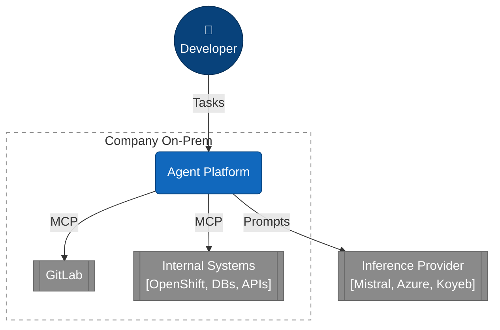

# Coding Agent

Architecture evaluation for an **agentic coding platform at a Company** with maximum data sovereignty: agents work on confidential code and internal systems, while LLM inference is consumed as an external service (no own GPUs, no own model hosting).

## Overview

The central question is **where the agent runtime lives** – this defines the trust boundary:

| | Variant A – Remote Inference | Variant B – Cloud Agent Runtime |
|---|---|---|
| Agent, memory, state | On-prem | Cloud |
| Tools | On-prem | On-prem, via MCP Gateway |
| LLM | External | External |
| Crosses the boundary | Minimized prompts only | Prompts, agent state, tool results |
| Security boundary | LLM Gateway (egress) | MCP Gateway (ingress) |
| Data sovereignty | Maximum | Reduced |

## Documents

### Architecture

| Document | Content |
|---|---|
| [Variant A – Remote Inference](infrastructure/variant_a_remote_inference.md) | Agent on-prem, inference external. C4 views (context, container, component, deployment), principles, data classes. |
| [Variant B – Cloud Agent Runtime](infrastructure/variant_b_cloud_agent_runtime.md) | Agent + LLM in the cloud, internal systems via MCP Gateway. |

### Inference Providers

| Document | Content |
|---|---|
| [Mistral Enterprise](infrastructure/mistral_enterprise_confidential_coding_agent.md) | Contracts, zero data retention, GDPR/DPA, residency, recommended Company architecture. |
| [Azure AI Foundry](infrastructure/providers/azure_ai_foundry_confidential_coding_agent.md) | Data protection position, network setup, contract stack, review checklist. |

### Workflows

| Document | Content |
|---|---|
| [Agentic Workflows with LangGraph](workflows/summary.md) | When agentic workflows pay off; state, branching, parallelism, HITL. |

### Sources

[.sources/](.sources/) – background material (German) on agent anatomy, multi-agent patterns, LangGraph and production deployment. Input only, not curated.

## Status

Architecture evaluation – no implementation yet. Current focus: **Variant A**.
