# Agentic AI: Workflows

This document focuses on **workflows that benefit from an agentic architecture** rather than on AI agents as an abstract concept.

The main advantage of LangGraph-style orchestration is not simply that an LLM can call tools. The advantage is that a workflow can **keep state, branch dynamically, run tasks in parallel, repeat steps, pause for human approval, and resume after failures**.

---

## 1. When an Agentic Workflow Makes Sense

A normal LLM call is usually sufficient when the task is:

- one prompt -> one answer
- deterministic
- short-lived
- based on a small amount of context
- not dependent on external tools or approvals

An agentic workflow becomes useful when the task contains several dependent steps.

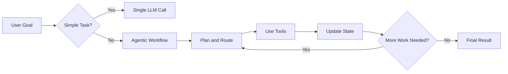

Typical reasons to use an agentic workflow:

- multiple tools or systems must be used
- later steps depend on earlier results
- the workflow needs retries or corrective loops
- several subtasks can run in parallel
- a human must approve critical actions
- execution may take longer than one request
- intermediate state must survive interruptions or failures

---

## 2. Core Workflow Capabilities

The architecture is especially useful because it combines several workflow mechanisms.

| Capability | Benefit | Typical Example |
|---|---|---|
| **Sequential steps** | Enforces a defined order | Analyze -> implement -> test |
| **Conditional routing** | Selects the next step dynamically | Test failed -> fix; test passed -> review |
| **Parallel execution** | Reduces total runtime | Run security, tests, and documentation checks together |
| **Iterative loops** | Improves results until a condition is met | Implement -> review -> fix -> review |
| **Persistent state** | Keeps intermediate results | Continue a workflow after restart |
| **Human-in-the-Loop** | Controls risky actions | Approve deployment or database change |
| **Tool usage** | Connects the LLM to real systems | Git, APIs, databases, CI/CD, search |
| **Specialized agents** | Separates responsibilities | Coding agent, reviewer, security agent |

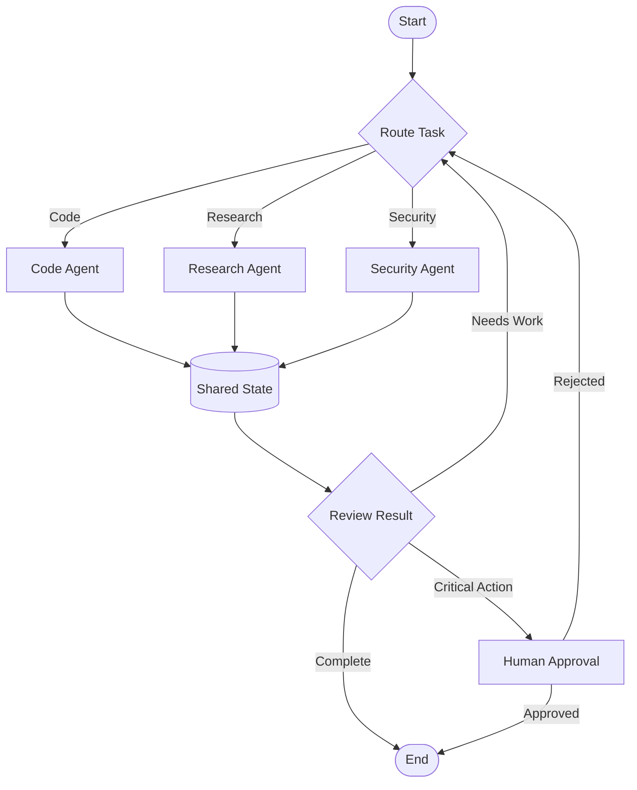

---

# 3. Software Development Workflows

Software engineering is a strong use case because development tasks naturally contain **tool calls, feedback loops, tests, branching decisions, and approvals**.

## 3.1 Feature Implementation

Instead of asking an LLM to generate code once, the workflow can continue until the implementation satisfies defined checks.

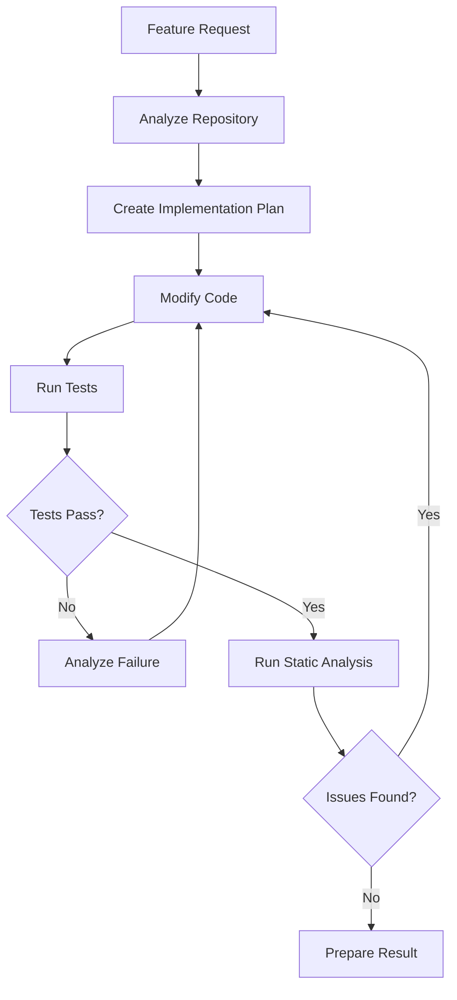

### Why the architecture helps

- repository analysis can happen before implementation
- test failures automatically return to the coding step
- static analysis can create another corrective loop
- intermediate findings remain available in shared state
- the workflow stops only when defined conditions are met

---

## 3.2 Pull Request Review

Several independent review tasks can run in parallel.

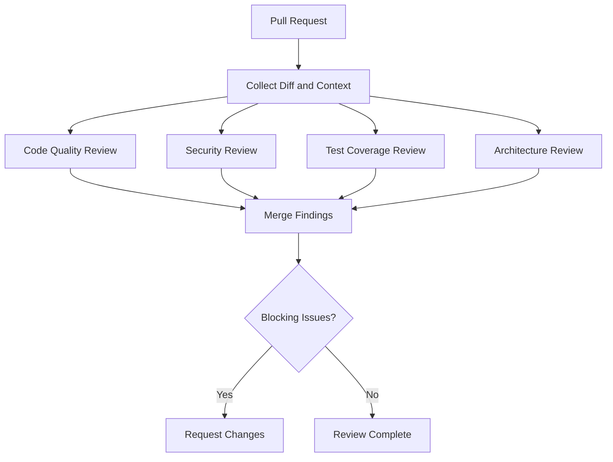

### Why the architecture helps

- reviewers can run concurrently
- each agent can specialize in one responsibility
- findings can be normalized into one shared result
- blocking issues can be separated from informational comments

---

## 3.3 CI/CD Failure Investigation

A failed pipeline often requires several investigative steps rather than one answer.

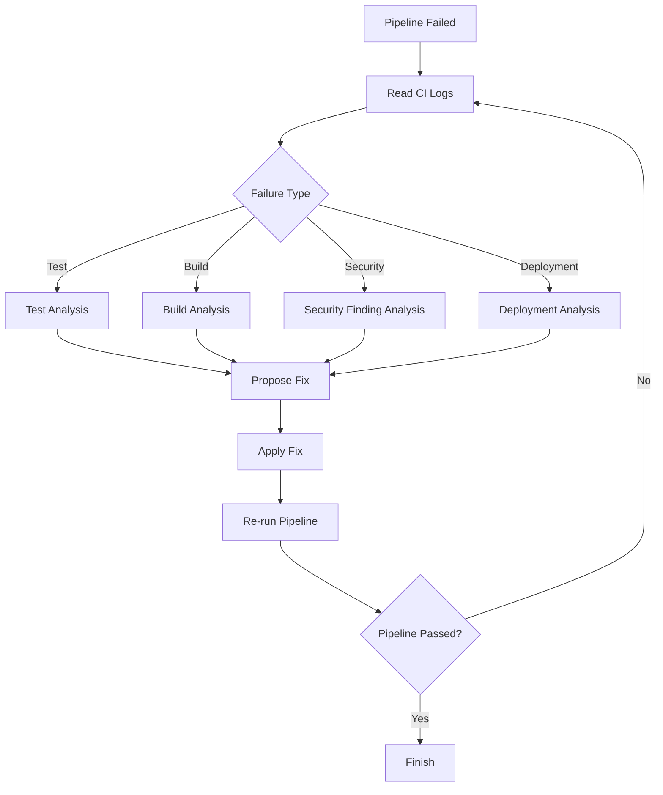

### Why the architecture helps

The workflow can repeatedly inspect the latest failure, select the appropriate diagnostic path, apply a correction, and retry without restarting the whole reasoning process.

---

# 4. Security Workflows

Security workflows benefit from clear boundaries between **analysis**, **automated actions**, and **human approval**.

## 4.1 Vulnerability Triage

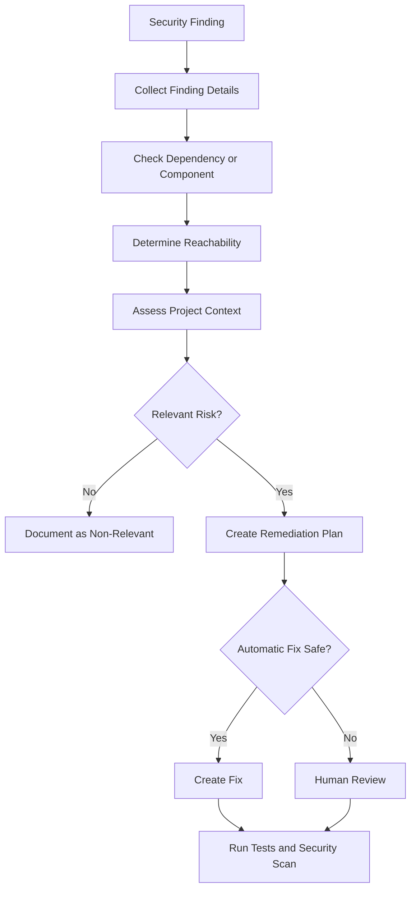

### Possible tools

- dependency scanners
- SBOM data
- source-code search
- Git repository
- issue tracker
- CI/CD pipeline

---

## 4.2 Security Gate Before Deployment

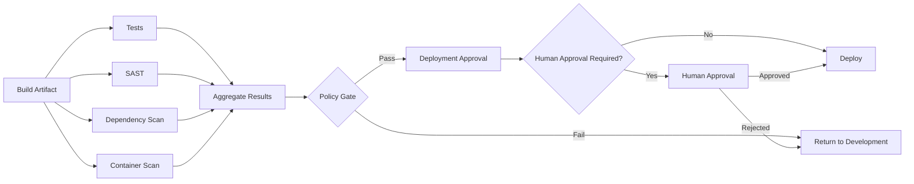

The LLM does not have to make the final security decision. Deterministic policies can remain authoritative while the agent handles investigation, explanation, and remediation assistance.

---

# 5. Research and Knowledge Workflows

Research workflows benefit from **parallel information gathering**, **validation**, and **iterative synthesis**.

## 5.1 Technical Research

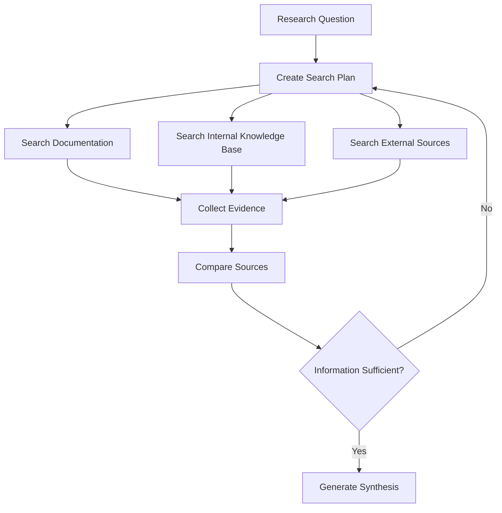

### Why the architecture helps

- multiple sources can be queried simultaneously
- missing information can trigger another research loop
- evidence can be stored separately from generated conclusions
- the final answer can include traceable source references

---

## 5.2 Internal Knowledge Assistant

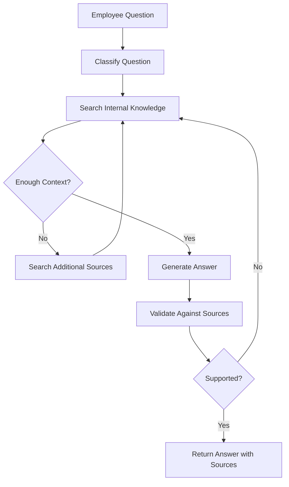

This is more robust than a single RAG request when one retrieval step is not guaranteed to return enough context.

---

# 6. Operations and Incident Workflows

Operational tasks often require a loop of **observe -> diagnose -> act -> verify**.

## 6.1 Incident Investigation

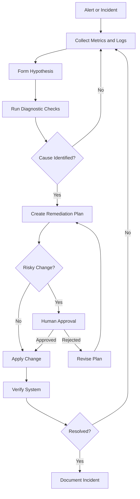

### Why the architecture helps

- diagnostics can use different tools depending on the incident
- hypotheses can be revised based on new evidence
- production changes can require explicit approval
- verification is part of the workflow instead of an optional final step

---

# 7. Data and Database Workflows

## 7.1 Natural-Language Data Analysis

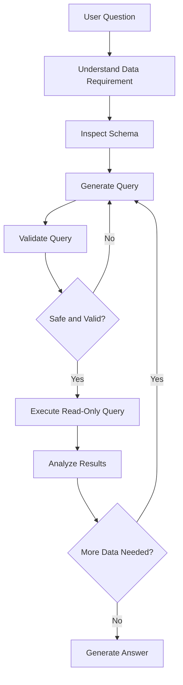

The architecture is particularly useful when the agent must inspect an unknown schema, refine queries, and validate results before answering.

---

## 7.2 Controlled Database Changes

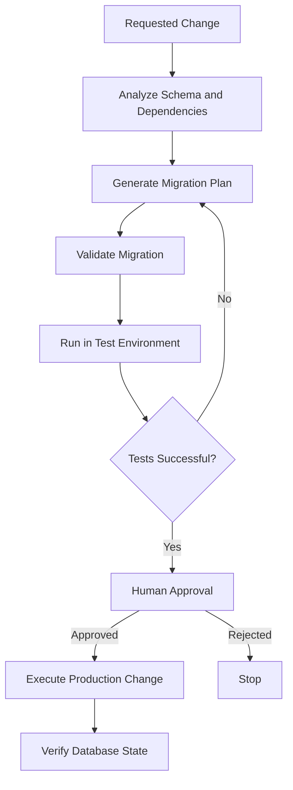

This is a typical case where **Human-in-the-Loop** is more important than full autonomy.

---

# 8. Document and Report Workflows

## 8.1 Report Generation with Review Loop

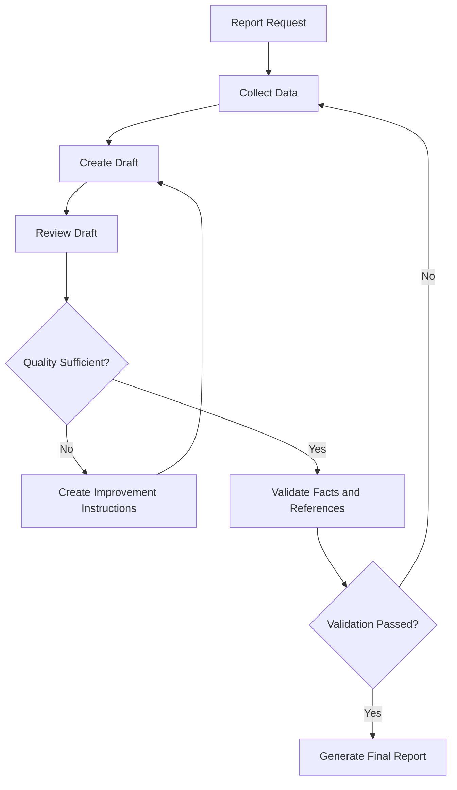

This pattern is useful for technical reports, documentation, summaries, and compliance material where one-pass generation is insufficient.

---

# 9. Human-in-the-Loop Workflows

Not every step should be autonomous.

Human approval is useful before actions such as:

- production deployment
- deleting or modifying data
- merging important code changes
- sending external communication
- changing infrastructure
- modifying security policies
- approving financial or legal actions

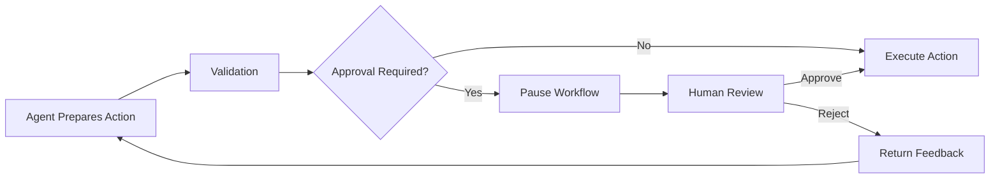

LangGraph-style state persistence allows the workflow to pause at the approval step and continue later without losing the previous execution context.

---

# 10. Multi-Agent Architecture

A multi-agent setup is useful when responsibilities are clearly separable.

For example, a software engineering workflow could use:

- **Coordinator Agent** - decides which specialist is required
- **Code Agent** - reads and modifies source code
- **Test Agent** - executes and analyzes tests
- **Security Agent** - checks vulnerabilities and unsafe changes
- **Documentation Agent** - updates documentation
- **Review Agent** - checks the combined result

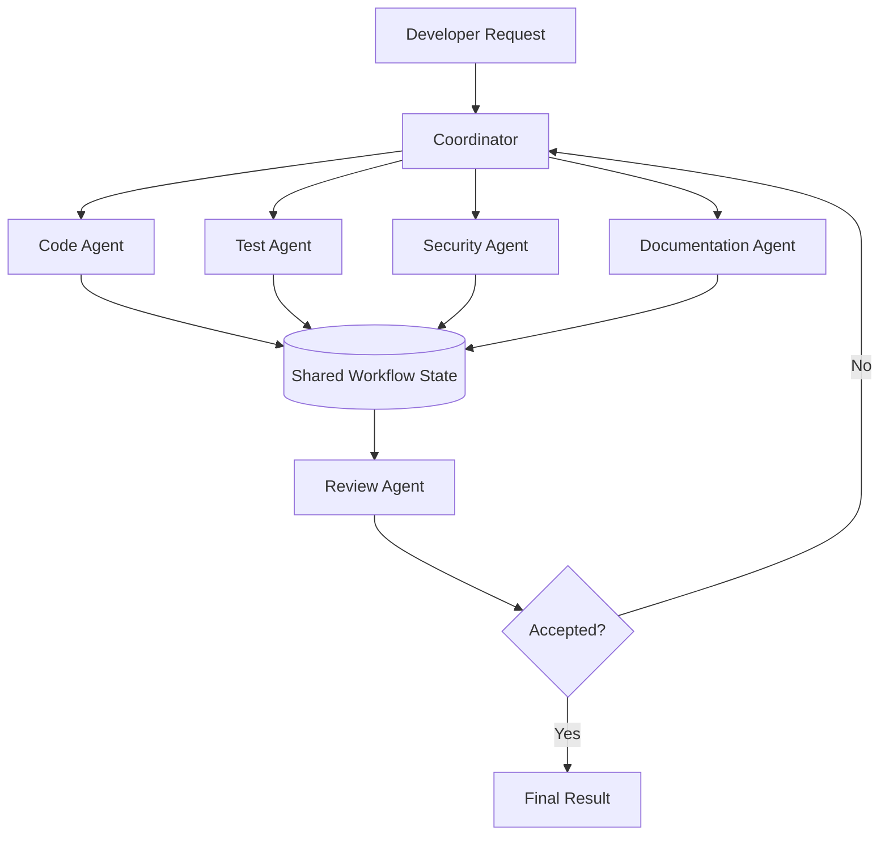

The benefit is not the number of agents. Multiple agents are useful only when they provide **clear separation of responsibilities, tools, context, or permissions**.

---

# 11. LangGraph Workflow Patterns

The underlying workflow patterns can be reduced to five common structures.

## Sequential

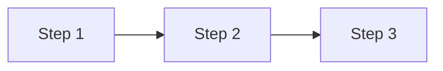

Use when every step depends on the previous one.

## Parallel

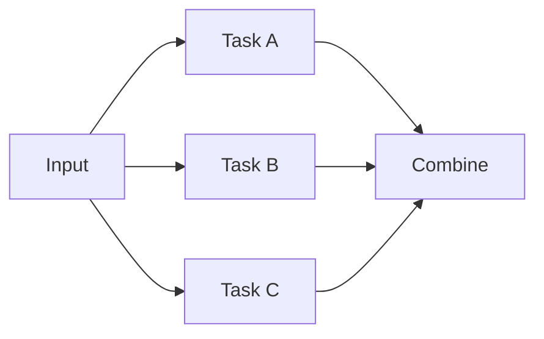

Use when independent work can happen concurrently.

## Conditional Routing

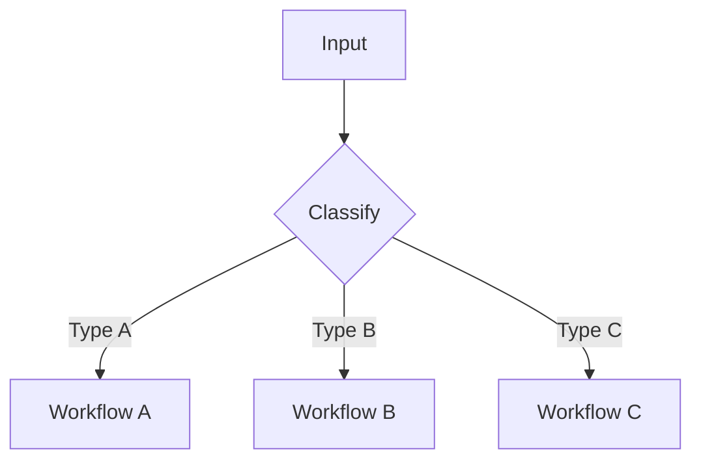

Use when the next action depends on runtime information.

## Iterative Loop

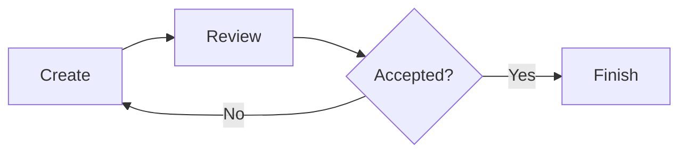

Use when quality can only be determined after evaluation.

## Human Approval

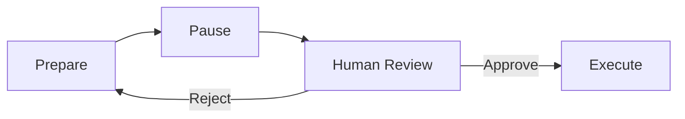

Use when automation must stop before a sensitive action.

---

# 12. Technical Building Blocks

A practical implementation typically contains the following components.

```mermaid
flowchart TB
    UI[Client / IDE / API] --> API[Application API]
    API --> ORCH[LangGraph Orchestrator]

    ORCH --> LLM[LLM Endpoint]
    ORCH --> TOOLS[Tool Layer]
    ORCH --> STATE[(State Store)]

    TOOLS --> GIT[Git Repository]
    TOOLS --> CI[CI/CD]
    TOOLS --> DB[(Database)]
    TOOLS --> KB[Knowledge Base]
    TOOLS --> APIs[Internal APIs]

    ORCH --> OBS[Observability]
    ORCH --> HITL[Human Approval]
```

Typical technologies:

- **Python / asyncio** - concurrent workflow execution
- **LangGraph** - stateful orchestration
- **Pydantic** - structured and validated data between workflow steps
- **PostgreSQL / SQLite** - persistent checkpoints and workflow state
- **FastAPI** - API layer
- **LLM endpoint** - local model, private cloud model, or external API
- **tool adapters** - Git, CI/CD, databases, search, internal services
- **observability** - traces, latency, token usage, tool execution, errors

---

# 13. Decision Guide

Use a simple LLM or RAG call when the task is short and mostly informational.

Use an agentic workflow when several of the following apply:

- [ ] multiple execution steps
- [ ] external tools
- [ ] conditional decisions
- [ ] retries or correction loops
- [ ] parallel subtasks
- [ ] persistent state
- [ ] long-running execution
- [ ] specialized roles
- [ ] human approval
- [ ] auditability of intermediate steps

The more of these characteristics a workflow has, the more value an orchestrator such as LangGraph can provide.

---

# 14. Main Takeaway

The strongest use case for an agentic architecture is not a chatbot that can call many tools.

It is a **stateful workflow engine around an LLM**:

```text
Goal
  -> Plan
  -> Execute tools
  -> Evaluate results
  -> Route to the next step
  -> Retry or request approval if required
  -> Continue from stored state
  -> Produce a verified result
```

For software development, security, operations, research, data analysis, and document workflows, this architecture can convert a single LLM interaction into a controlled multi-step process.
