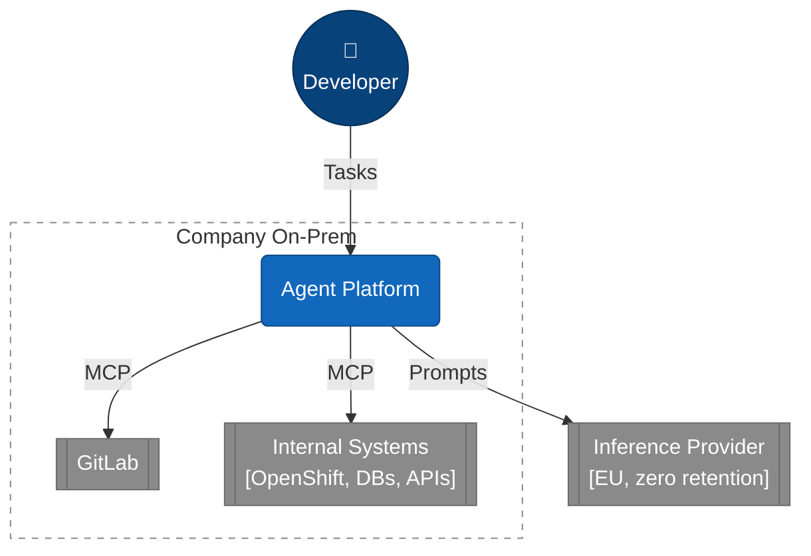
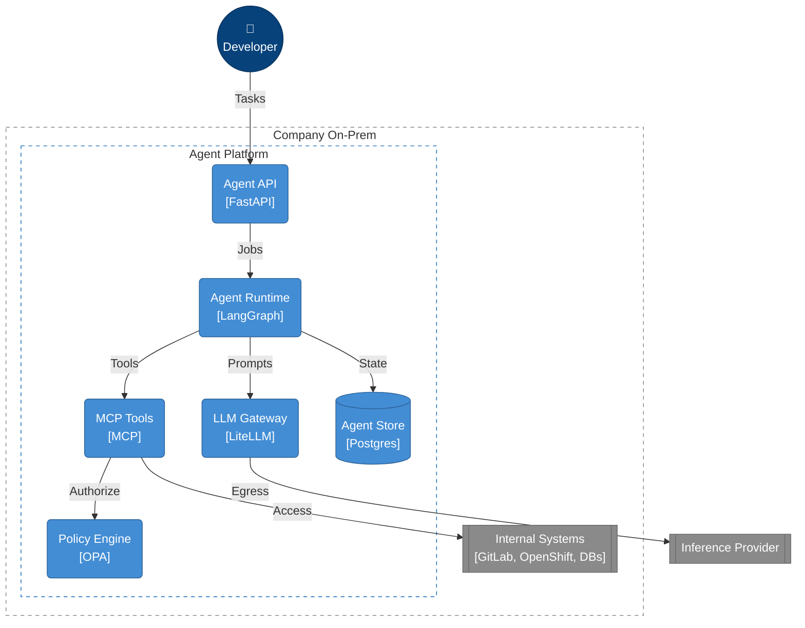
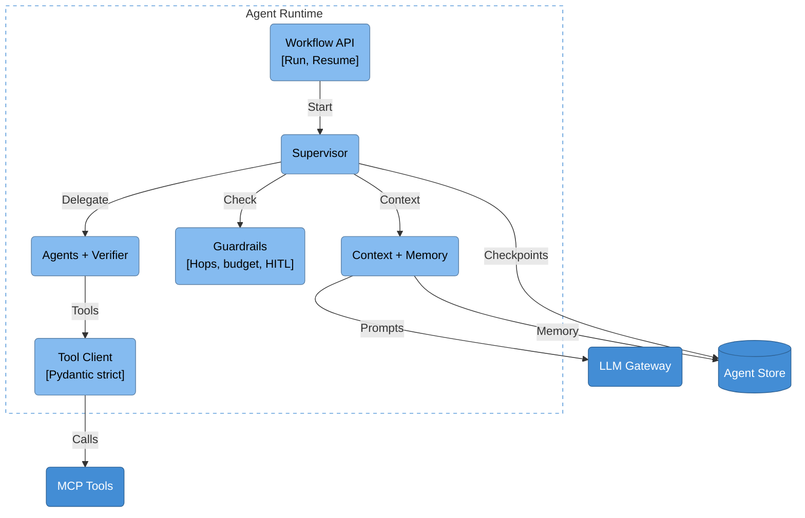
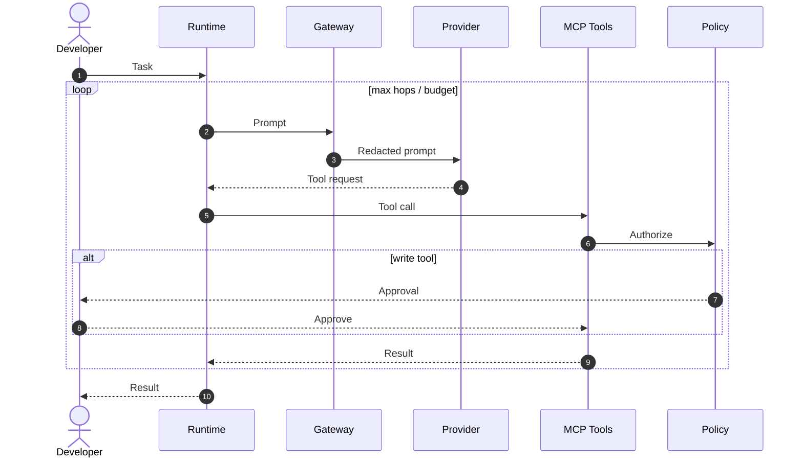
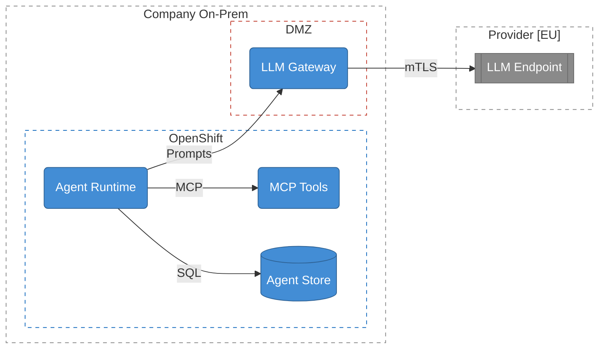

# Variant A – Remote Inference, Agent On-Prem

## Goal

- Run **agent logic, tools, state, memory and logs on-prem** (Company).
- Consume **LLM inference as an external service** – no own GPUs, no own model hosting.
- The **LLM Gateway is the only egress path**; everything else stays inside Company.

## Principles

| # | Principle | Consequence |
|---|---|---|
| P1 | Single egress | Only the LLM Gateway may reach the internet; enforced by egress firewall. |
| P2 | Stateless provider | Provider processes prompts in-flight only: zero data retention, no training, EU region. |
| P3 | Data minimization | Context Manager selects, gateway redacts; never whole repositories. |
| P4 | State on-prem | Checkpoints, memory, RAG index, traces, secrets never leave Company. |
| P5 | Read-only first | Write tools only behind policy + human approval (HITL). |
| P6 | Bounded loops | Max hops, token budget, timeout per task. |
| P7 | Provider-agnostic | OpenAI-compatible API behind the gateway; provider switch = config change. |

## C4 Model

Views follow the [C4 model](https://c4model.com):

| Level | View | Question |
|---|---|---|
| 1 | System Context | Who uses the system, which systems does it touch? |
| 2 | Container | Which deployable units exist, how do they talk? |
| 3 | Component | How is the Agent Runtime structured? |
| – | Dynamic | How does one task flow through the system? |
| – | Deployment | Where does each container run, where is the trust boundary? |

Level 4 (code) is out of scope.

**Legend**

| Shape | Meaning |
|---|---|
| Circle 👤 (dark blue) | Person |
| Rounded box (blue) | Our system / container / component |
| Box with side bars (grey) | Existing or external system |
| Cylinder | Data store |
| Dashed frame | Boundary / trust zone |
| `[...]` | Technology or note |

## L1 – System Context

## L2 – Container

Not shown: Sandbox Runner, Trace Store, Secrets Vault.

| Container | Responsibility | Data sovereignty role |
|---|---|---|
| Agent API | Stateless ingress, auth, async job submit | No LLM access |
| Agent Runtime | Graph-based orchestration, agents, loop control | Decides what context is sent |
| MCP Tool Servers | One server per target system, narrow typed tools | Credentials never reach the LLM |
| Sandbox Runner | Ephemeral, network-restricted execution | Arbitrary code never runs on shared hosts |
| Policy Engine | RBAC, allowlist, project scoping, approval rules | Enforces P5 |
| LLM Gateway | Routing, secret redaction, token budget, circuit breaker, audit | Enforces P1, P3, P7 |
| Agent Store | Checkpoints, short/long-term memory, RAG index, event log | Enforces P4 |
| Trace Store | Full reasoning traces, cost metrics | Self-hosted instead of SaaS tracing |
| Secrets Vault | Tool credentials | Secrets never in prompts or `.env` |

## L3 – Component: Agent Runtime

**Pattern:** Supervisor over swarm – higher token cost, but every sub-result is validated (coding tasks need validation more than speed).

**Memory (all in Agent Store):**

| Type | Content | Storage |
|---|---|---|
| Short-term | Graph state, message history | Checkpointer (PostgreSQL) |
| Semantic | Code embeddings | pgvector |
| Episodic | Past tasks, review feedback, corrections | PostgreSQL |
| Procedural | Conventions, ADRs, team rules | PostgreSQL / repo files |

## Dynamic – One Task (ReAct Loop with HITL)

## Deployment – Trust Zones

## Data Classes

| Data | Stored | Leaves Company |
|---|---|---|
| Repositories | GitLab | Selected snippets only, in-flight |
| Agent state, checkpoints | Agent Store | No |
| Memory, RAG index | Agent Store | No (see embeddings below) |
| Traces, prompts, costs | Trace Store | No |
| Secrets, credentials | Vault | Never – redacted by gateway |
| Prompts + completions | – | Yes, in-flight; provider must not retain |

## Inference Provider Options

| Option | Example | Retention control | Our effort |
|---|---|---|---|
| Managed model API with ZDR | [Mistral Enterprise](mistral_enterprise_confidential_coding_agent.md), [Azure AI Foundry](providers/azure_ai_foundry_confidential_coding_agent.md) | Contractual | None |
| Rented GPU, own vLLM container | Koyeb or similar | Technical + contractual | Deploy model image, no hardware |

Both sit behind the same gateway; switching is a routing change.

## LLM Gateway

Responsibilities:

- OpenAI-compatible API (`/v1/chat/completions`, `/v1/responses`)
- Secret / PII redaction on outbound prompts
- Token budget per task, user and day; hard stop on overrun
- Circuit breaker, retries with idempotency keys, fallback provider
- Audit log of every outbound request (metadata on-prem)
- mTLS to provider, pinned endpoint

## Tool Design

| Tool | Class | Approval |
|---|---|---|
| `read_repository_file(project_id, path)` | read | auto |
| `get_git_diff(project_id)` | read | auto |
| `get_pod_logs(namespace, pod)` | read | auto |
| `query_database_readonly(query_id, params)` | read (predefined queries) | auto |
| `run_tests(project_id)` | execute (sandbox) | auto |
| `create_merge_request(project_id, branch)` | write | HITL |

Not allowed: `run_arbitrary_shell`, `execute_raw_sql`, `ssh`, direct network access.

Tool descriptions (docstrings) are part of the LLM interface – they are versioned and reviewed like code.

## Design Decisions

| Decision | Rationale |
|---|---|
| Graph-based orchestration (LangGraph) behind Run/Resume/GetState interface | Cyclic loops + checkpoints; no framework lock-in |
| Single PostgreSQL (+ pgvector) for state, memory, RAG, event log | One store to secure, back up and audit on-prem |
| Self-hosted tracing instead of LangSmith SaaS | Full prompts are sensitive; traces stay on-prem |
| Structured output with Pydantic strict | LLM output is untrusted input to tools |
| Supervisor + Verifier | Validation before any result or write |
| Egress only via gateway in DMZ | One control point for redaction, budget, audit |

## Advantages

- Maximum data sovereignty without own GPUs
- Provider sees only minimized prompts, never systems, credentials or state
- Tools, policy and approvals fully under Company control
- Provider switch without architecture change

## Risks and Open Points

- **Prompts leave Company in-flight** – mitigated by minimization, redaction, ZDR contract; not eliminated.
- **Embeddings:** remote embedding sends the whole codebase out. Prefer a small CPU-capable embedding model on-prem, or accept and contract it explicitly.
- **Latency:** each ReAct hop crosses the WAN; budget for many round-trips.
- **Rented-GPU option:** provider still has host access; check confidential-computing GPUs if required.
- **Operational load on-prem:** runtime, stores, tracing and gateway must be run by Company.
